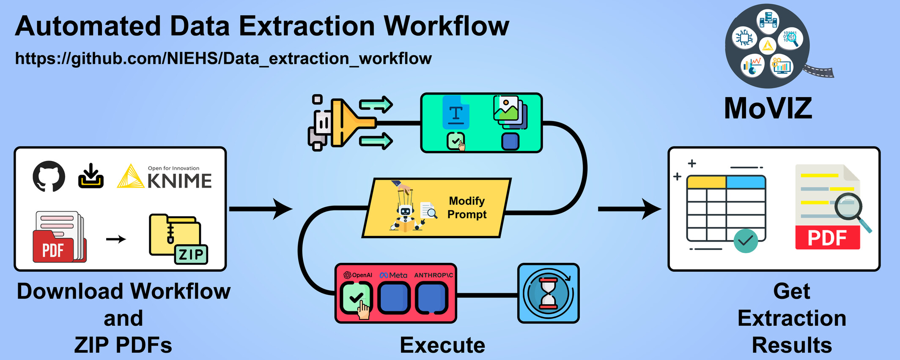

# MoVIZ Data Extraction Workflow

[](https://doi.org/10.1002/wcms.70047)

[](https://doi.org/10.1002/wcms.70047)

MoVIZ - Data Extraction is a KNIME workflow for extracting structured information from scientific
literature and general PDF files with large language models (LLMs). It was
developed for the publication [**Automating Data Extraction from Scientific
Literature and General PDF Files Using Large Language Models and KNIME: An
Application in Toxicology**](https://doi.org/10.1002/wcms.70047).

## Latest Release

The current release is **[version 1.1.0](https://github.com/Moreira-Filho/Data_extraction_workflow/releases/tag/v1.1.0)**.

Version 1.1.0 introduces the MoVIZ - Data Extraction KNIME extension for easier
installation, fixes API-call issues, and adds updated LLM options. The extension
includes the Python dependencies required by its nodes, so a separate Conda
environment is no longer required.

### Quick Start

1. Install [KNIME Analytics Platform](https://www.knime.com/downloads/) 5.12.0
   or newer.
2. Open the [illustrated installation guide](versions/v1.1.0/README.md).
3. Download the workflow and extension using the links in the guide.
4. Install the extension, import the workflow archive, and run the workflow.

The installation guide is also available as a
**[printable PDF](versions/v1.1.0/Installation-Guide-v1.1.0.pdf)**.

## Versions

| Version | Status | Installation | Release |
| --- | --- | --- | --- |
| 1.1.0 | Current | [Illustrated guide](versions/v1.1.0/README.md) | [Downloads and release notes](https://github.com/Moreira-Filho/Data_extraction_workflow/releases/tag/v1.1.0) |
| 1.0.0 | Legacy | [Conda-based guide](versions/v1.0.0/README.md) | [Source snapshot](https://github.com/Moreira-Filho/Data_extraction_workflow/tree/v1.0.0) |

## GROBID Support

[GROBID](https://grobid.readthedocs.io/en/latest/Install-Grobid/) is required
only for the scientific-literature mode. It is not required for the other
workflow modes. GROBID is not officially supported on Windows; see the
version-specific installation guide for details.

## Large Files

The KNIME archives and the version 1.1.0 extension package are managed with
[Git LFS](https://git-lfs.com/). For normal installation, use the named links on
the GitHub release page instead of GitHub's automatically generated **Source
code** archives.

To clone all files, including the LFS-managed extension archive:

```sh
git lfs install
git clone https://github.com/Moreira-Filho/Data_extraction_workflow.git
```

## Repository Layout

- `versions/v1.1.0/`: current workflow, extension, and illustrated guide
- `versions/v1.0.0/`: legacy workflow, environment, and installation guide
- Git tags `v1.0.0` and `v1.1.0`: immutable snapshots of the published versions
