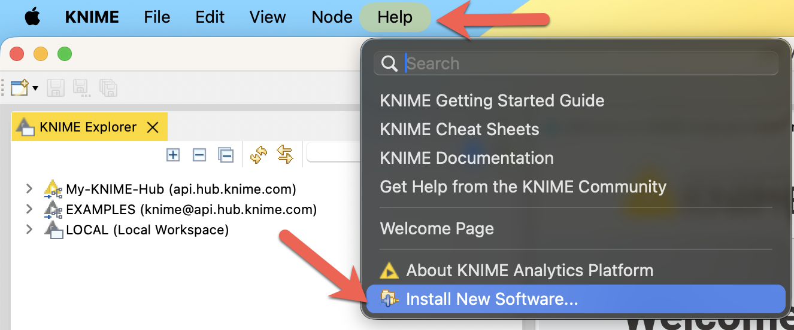
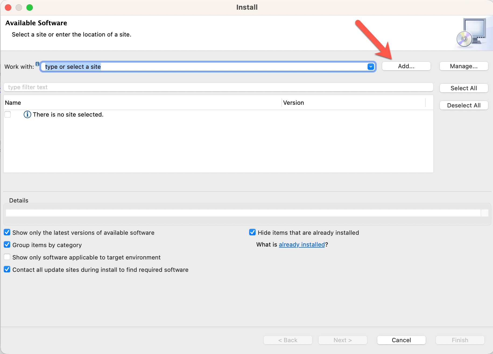
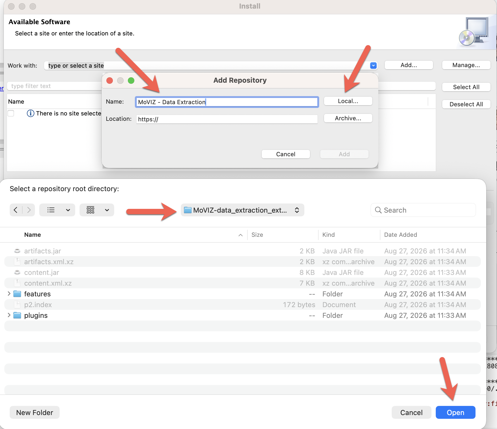
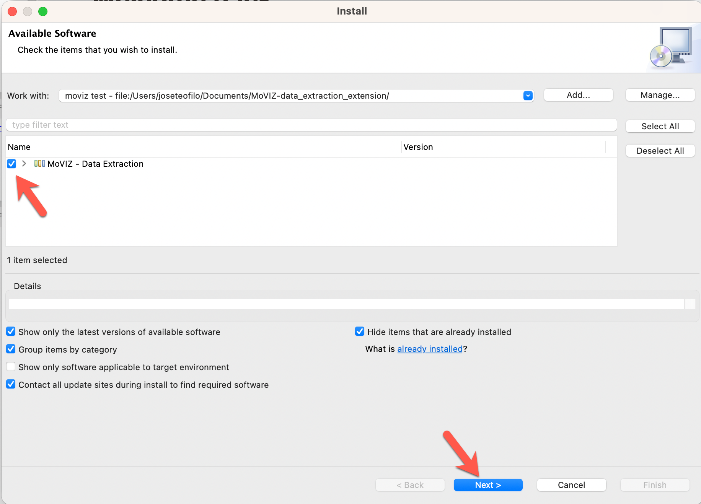
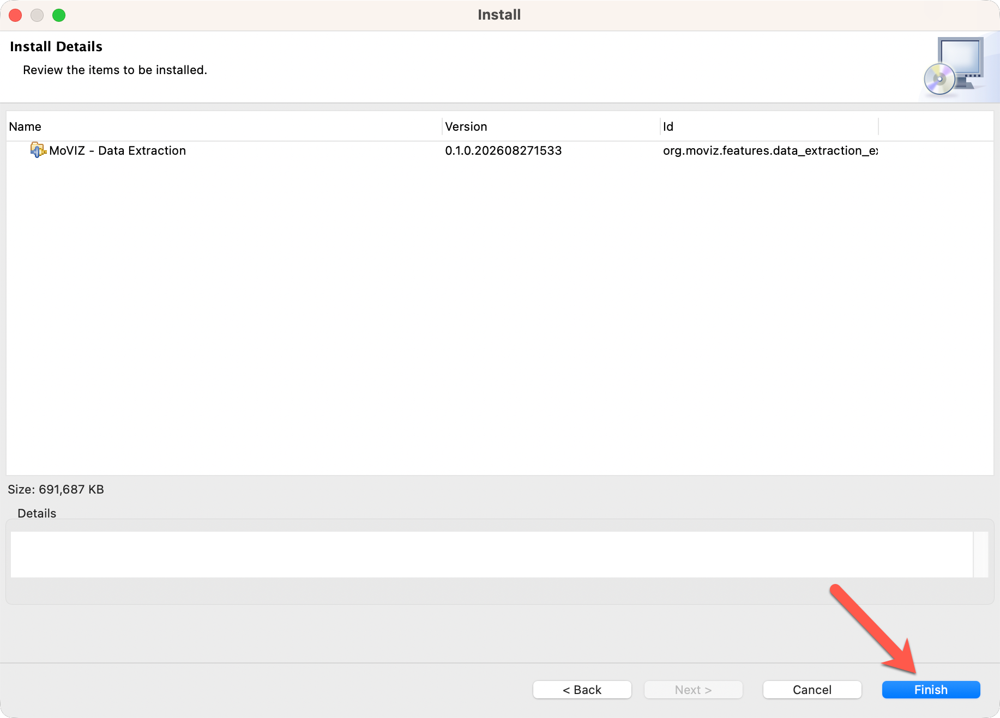
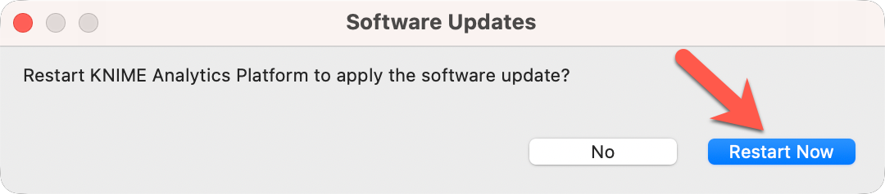
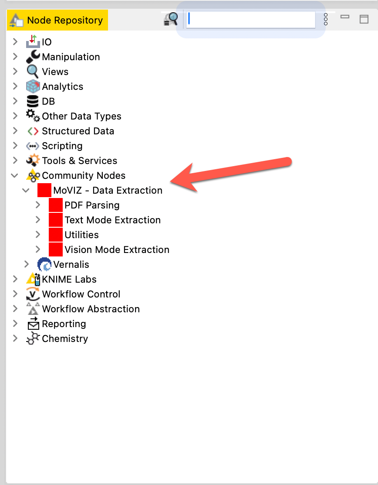

# MoVIZ Data Extraction Workflow v1.1.0

This guide explains how to install the MoVIZ - Data Extraction KNIME extension
and import the version 1.1.0 workflow. A
[printable PDF version](Installation-Guide-v1.1.0.pdf) is also available.

## What's New

- Easier installation through the MoVIZ - Data Extraction KNIME extension
- Python dependencies packaged with the extension; no separate Conda setup
- Bug fixes for API calls
- Updated and newer LLM options for data extraction

## Requirements and Downloads

- [KNIME Analytics Platform](https://www.knime.com/downloads/) 5.12.0 or newer
- [Data Extraction Workflow v1.1.0 (`.knar`)](https://github.com/Moreira-Filho/Data_extraction_workflow/releases/download/v1.1.0/Data-Extraction-Workflow-v1.1.0.knar)
- [MoVIZ - Data Extraction Extension v1.1.0 (`.zip`)](https://github.com/Moreira-Filho/Data_extraction_workflow/raw/v1.1.0/versions/v1.1.0/MoVIZ-Data-Extraction-Extension-v1.1.0.zip)
- [GROBID](https://grobid.readthedocs.io/en/latest/Install-Grobid/) for the scientific-literature mode only

The extension archive is approximately 2.86 GB and is stored using Git LFS. Use
the extension link above rather than GitHub's automatically generated **Source
code** archives.

GROBID is not required for the other workflow modes and is not officially
supported on Windows. Windows users can skip GROBID and use the remaining modes.

## Install the KNIME Extension

1. Download the
   [MoVIZ - Data Extraction extension](https://github.com/Moreira-Filho/Data_extraction_workflow/raw/v1.1.0/versions/v1.1.0/MoVIZ-Data-Extraction-Extension-v1.1.0.zip).
2. Extract the downloaded archive to a local folder.
3. Locate the extracted folder containing both `content.jar` and
   `artifacts.jar`. If these files are inside an additional subfolder, use that
   subfolder in the following steps.
4. Open KNIME Analytics Platform.
5. Select **Help > Install New Software...**.

   

6. Click **Add...** in the Available Software window.

   

7. Enter a name such as `MoVIZ - Data Extraction`, click **Local...**, select
   the extracted folder containing `content.jar` and `artifacts.jar`, and click
   **Open**.

   

8. Select **MoVIZ - Data Extraction** from the update site and click **Next**.

   

9. Review the installation details and click **Finish**.

   

10. Accept the license terms and complete the installation.
11. When prompted, click **Restart Now**.

    

After KNIME restarts, the nodes are available under **Community Nodes > MoVIZ -
Data Extraction**.



## Optional: Install GROBID

GROBID is needed only for the scientific-literature mode. For complete details,
see the [official GROBID installation guide](https://grobid.readthedocs.io/en/latest/Install-Grobid/).

1. Install a supported JDK. GROBID 0.8.0 was tested with JDK 11 through JDK 17.
2. Download [GROBID 0.8.0](https://github.com/kermitt2/grobid/archive/0.8.0.zip).
3. Extract it to a folder whose path contains no spaces.
4. In a terminal, navigate to the extracted `grobid-0.8.0` folder.
5. Build GROBID:

   ```sh
   ./gradlew clean install
   ```

6. Start the local server:

   ```sh
   ./gradlew run
   ```

7. Confirm that GROBID is available at <http://localhost:8070/>.

Start the GROBID server before running the scientific-literature mode. See the
[GROBID platform notes](https://grobid.readthedocs.io/en/latest/Frequently-asked-questions/#windows-related-issues)
for Windows-related limitations.

## Import and Run the Workflow

1. Download the
   [Data Extraction Workflow v1.1.0](https://github.com/Moreira-Filho/Data_extraction_workflow/releases/download/v1.1.0/Data-Extraction-Workflow-v1.1.0.knar).
2. In KNIME Analytics Platform, select your **Local Space**.
3. Select **Import Workflow**.
4. Browse to `Data-Extraction-Workflow-v1.1.0.knar` and import it.
5. Open the imported workflow.
6. If you are using the scientific-literature mode, start the local GROBID
   server before executing the workflow.
7. Configure the workflow for your data and run it.
